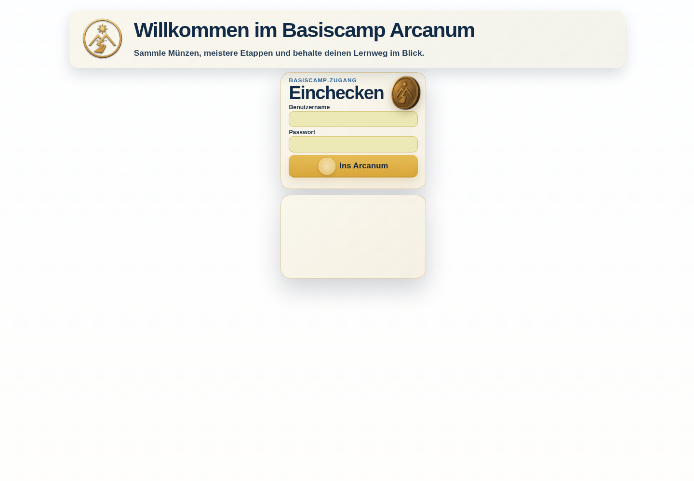
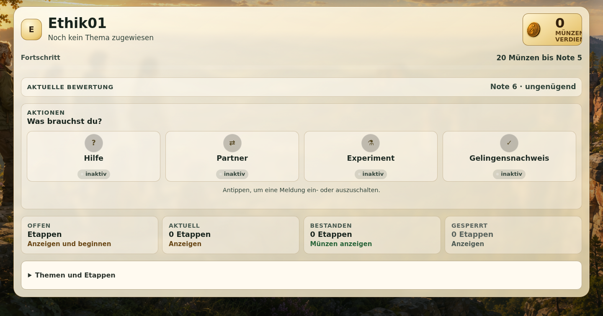
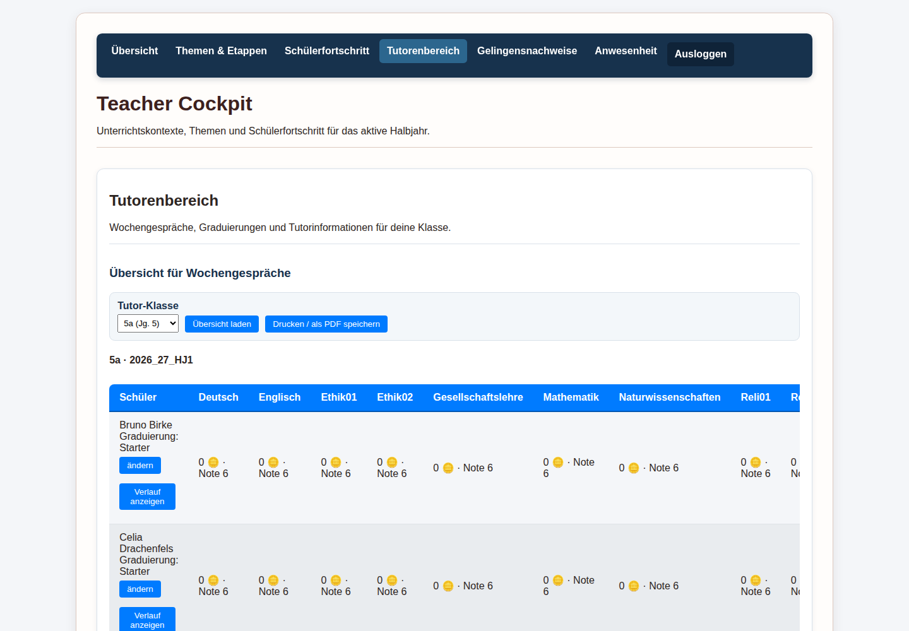

# Arcanum DEMO

Öffentliche DEMO (getrennte Testumgebung) des Arcanum-Lernsystems.

**DEMO öffnen:** [https://arcanum-demo.dynv6.net](https://arcanum-demo.dynv6.net)

## Schnellstart

1. Öffne die DEMO-Adresse in einem aktuellen Browser. Ein Laptop ist für den ersten Rundgang empfehlenswert, aber nicht erforderlich. Tablet und Smartphone werden ebenfalls unterstützt.
2. Öffne die [öffentliche Zugangsdaten-PDF](./Arcanum_DEMO_Zugangsdaten.pdf). Sie enthält die verwendbaren Konten für Administration, Lehrkräfte und Schüler.
3. Wähle eine Rolle und melde dich mit dem zugehörigen Konto an.
4. Folge dem [deutschen DEMO-Handbuch](./docs/handbuch.de.md). Die vollständige englische Fassung steht im [englischen Handbuch](./docs/guide.en.md).

Die DEMO enthält ausschließlich synthetische Daten (frei erfundene Testdaten). Mehrere Personen verwenden dieselbe Umgebung: Änderungen an gemeinsam sichtbaren Daten können deshalb auch für andere Besuchende sichtbar sein.

## Einblicke in die DEMO

*Leere Anmeldeseite – Zugangsdaten werden erst nach Auswahl eines Kontos eingegeben.*

*Schülerdashboard mit Fach, Fortschritt und den verfügbaren Lernweg-Kacheln.*

*Tutoransicht (Ansicht für Klassenbetreuende) mit den fünf synthetischen Schülern aus 5a.*

## Öffentliche Zugangsdaten

Die Zugangsdaten-PDF ist absichtlich öffentlich und nur für diese DEMO bestimmt. Sie enthält 138 verwendbare Konten:

- 3 Administrationskonten
- 12 Lehrkraftkonten
- 123 Schülerkonten

In der DEMO existieren insgesamt 142 Konten. Vier technische `demo.umbau.*`-Konten haben keine verfügbare autorisierte Passwortquelle und werden deshalb nicht als verwendbare Zugänge veröffentlicht. PROD-Zugänge (Live-Zugänge), private Schlüssel, Tokens und Konfigurationsgeheimnisse sind nicht enthalten.

## DEMO zurücksetzen

Das Zurücksetzen entfernt gemeinsame Änderungen aller Testenden. Der geprüfte Ausgangsstand enthält die veröffentlichten verwendbaren Konten, die Klassen, 20 synthetische Schüler in 5a–5d und deren Fachzuordnungen.

Der aktuelle Zurücksetzweg ist ein Betreiberweg (manuell durch die verantwortliche Umgebung) und keine Schaltfläche im Web. Er wurde mit einem harmlosen Testeintrag geprüft. Eine öffentliche Webaktion mit ausdrücklicher Bestätigung ist noch nicht Teil der DEMO und wird hier nicht behauptet.

## Komponenten

- Der Arcanum-Kern stellt Anmeldung, Rollen, Schüler-, Lehrkraft- und Administrationsseiten, Curriculum (geplante Lerninhalte), Etappen und Aufgaben bereit.
- Das Arcanum-Overlay ist eine zusätzliche Anzeigeebene und unterstützt die Schüleransicht.
- Das Results-Plugin (Ergebnis-Erweiterung) unterstützt Ergebnis- und Lernstandsansichten.
- Das Anwesenheits-Plugin stellt „Anwesenheit“ und „Attendance verwalten“ bereit.
- Die Rollen- und Berechtigungsverwaltung steuert Rollen und Zugriffsrechte.
- SOL-Planer, SOL-Schülerübersichten, Displays/Signage, ScreenTinker und WebUntis-Anbindungen sind nicht Bestandteil dieser öffentlichen DEMO beziehungsweise in dieser Anleitung nicht als funktionsfähig geprüft.

## Weiterführende Dokumentation

- [Geführtes deutsches Handbuch](./docs/handbuch.de.md)
- [Guided English handbook](./docs/guide.en.md)

---

**English version:** [README.en.md](./README.en.md)
