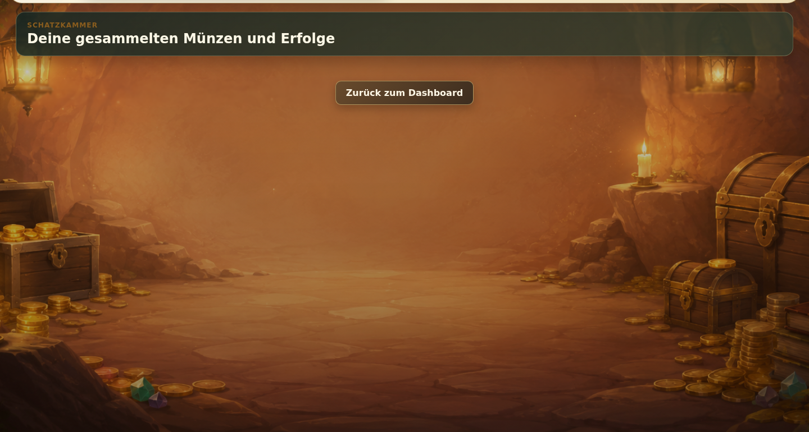
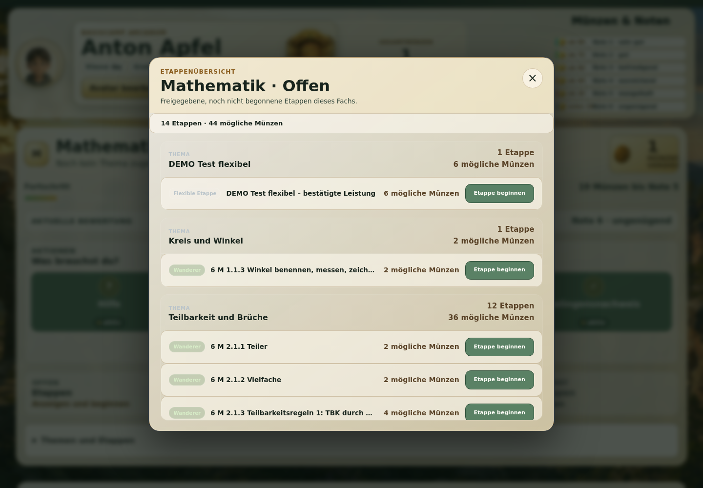

# Guided handbook for the public Arcanum DEMO

**DEMO:** [https://arcanum-demo.dynv6.net](https://arcanum-demo.dynv6.net)  
**Credentials:** [public credentials PDF](../Arcanum_DEMO_Zugangsdaten.pdf)

This handbook describes the DEMO checked on 4 October 2026. It uses synthetic data (fictional test data). A laptop is recommended for the first tour because more areas are visible at once, but no step requires a laptop or a particular operating system. The same tour works on a tablet or smartphone.

## 1. Quick start

**Roles:** Administration manages school years, classes, subjects, and system settings. Teachers see learning content, student progress, proofs of mastery (evidence of an achieved learning state), the tutor area, and attendance. Students see their own learning path, subjects, stages (sections of a learning path), tasks, coins, and grades.

1. Open the DEMO address.
2. Find an account for the desired role in the PDF. Passwords are provided only there.
3. Sign in and check the matching dashboard.
4. Use “Abmelden” or “Ausloggen” to leave.

*The sign-in page has empty fields; no password is entered in the image.*

The DEMO is shared. Saved assignments, progress, and attendance can be visible to other visitors. For a first tour, use pages, filters, and previews without saving.

## 2. Student area

**Account:** student. **Start:** signing in opens the student dashboard.

1. Check “Münzen & Noten” and the tiles “OFFEN”, “AKTUELL”, “BESTANDEN”, and “GESPERRT”.
2. Open “OFFEN – Etappen – Anzeigen und beginnen”.
3. Choose a subject, Thema (content area), stage, and task.
4. Read the task and return with the available navigation.
5. Check “BESTANDEN” and “GESPERRT” if content is available.

Five synthetic students are available in each of 5a–5d. They have Religion/Ethik as an individual subject; no WPF (elective subject selected from a group) assignment exists for grade 5. Grade 6 retains its existing WPF and Religion/Ethik assignments. Describe flexible learning content (additional learning paths) and individual subjects only when visible for the account.

*The dashboard shows a subject, progress, coins, and the available stage areas.*

*The treasure room shows collected coins and achievements; no credentials are visible.*

The “Partner” and “Gelingensnachweis” tiles appeared as “inaktiv” (inactive) for the checked student account. Partner search and readiness for a proof of mastery are therefore not confirmed DEMO scenarios.

## 3. Teacher area

**Account:** teacher. **Start:** signing in opens the “Teacher Cockpit”.

The checked menus are “Übersicht”, “Themen & Etappen”, “Schülerfortschritt”, “Gelingensnachweise”, “Tutorenbereich”, and “Anwesenheit”.

1. In “Themen & Etappen”, view available content and released stages.
2. In “Schülerfortschritt”, select only students offered by the page.
3. In “Gelingensnachweise”, open, filter, and sort the school-wide table. It shows first name, last name, class, stage, and entry when matching entries exist.
4. Open “Anwesenheit” for the school-wide overview.

The overview is for inspection and shows no passwords or private account data. Editing scope depends on the existing assignments.

## 4. Tutor view

The tutor view (view for class mentors) is not a separate account type. It is an area of an assigned teacher account.

1. Sign in with the assigned teacher.
2. Open “Tutorenbereich”.
3. Select 5a, 5b, 5c, or 5d.
4. Check that exactly the five students of that class appear.

All four classes were checked this way. The view accesses shared data; do not save changes during the tour.

*The checked tutor view shows the five synthetic students in class 5a.*

## 5. Administration area

**Account:** administration. **Start:** signing in opens the “Admin-Dashboard”.

The shared menu is “Übersicht”, “Schuldaten”, “Schuljahr & Zuordnungen”, “Zentrales Curriculum”, “Anwesenheit”, “Rechte”, and “System”.

### School year and assignments

“Schuljahr & Zuordnungen” shows the checked order:

1. “1. Schuljahr/Halbjahr”
2. “2. Jahrgang”
3. “3. Tutorien”
4. “4. REGULAR-Matrix” (required subjects per class)
5. “5. Individuelle Lehrkräfte”
6. “6. Schülerzuordnung”

HJ1 2026/27 is the active semester (currently valid school period). “Ausgewähltes Halbjahr aktivieren” changes shared state and should be used only for planned tests.

### Curriculum and school data

- “Zentrales Curriculum” shows central topics and stages. “Vorschau prüfen” is read-only; “Import bestätigen” changes data.
- “Schülerverwaltung öffnen” shows the student list and class filters.
- “Lehrkräfte verwalten” shows teacher accounts, adding, and editing.
- “Klassenverwaltung öffnen” shows classes, grades, and archiving.
- “Fächerverwaltung öffnen” shows subjects, subject type, and assignment type.

Saving, activating, importing, archiving, and deleting changes shared data.

### Attendance, rights, and system

- “Attendance” is the school-wide attendance overview with date, location, status, and class filters.
- “Attendance verwalten” manages areas and QR codes (scannable access codes).
- “Berechtigungen und Rollen verwalten” shows `teacher`, `student`, and `admin`.
- “Module verwalten” shows `attendance_plugin`, `results_plugin`, `plugin-loader`, `permission-manager`, and `arcanum-overlay`.

A web reset action, SOL planner, SOL student overviews, displays/signage, ScreenTinker, and WebUntis integrations are not verified as available DEMO features.

## 6. Adaptability

The DEMO shows REGULAR subjects (required subjects) by class, Religion/Ethik as an individual assignment, WPF in existing grade-six data, central curricula, and flexible learning paths when released for an account. These examples do not promise every possible school rule.

Subject-matter feedback and contributions are welcome through the public GitHub repository. No additional support channel is claimed.

## 7. Try-it scenarios

### A – Central stage and task

- **Prerequisite/role:** student account with a visible open stage.
- **Steps:** sign in → “OFFEN” → “Anzeigen und beginnen” → subject → stage → task.
- **Expected:** the task opens without a technical error.
- **Shared change:** opening creates no coins, performance, or Completion (stored task completion).

### B – Religion/Ethik in grade 5

- **Prerequisite/role:** student from 5a–5d.
- **Steps:** sign in → open subjects/learning path → check Religion/Ethik.
- **Expected:** the individual subject is visible; these examples have no WPF.
- **Shared change:** none.

### C – Tutor view

- **Prerequisite/role:** assigned teacher.
- **Steps:** sign in → “Tutorenbereich” → 5a, 5b, 5c, or 5d.
- **Expected:** exactly five students.
- **Shared change:** none.

### D – Proofs of mastery

- **Prerequisite/role:** teacher and matching entries.
- **Steps:** sign in → “Gelingensnachweise” → open the table → filter/sort.
- **Expected:** relevant student stages without private account data.
- **Shared change:** none.

### E – Administration tour

- **Prerequisite/role:** administration.
- **Steps:** open “Schuljahr & Zuordnungen”, “Zentrales Curriculum”, “Attendance”, “Berechtigungen und Rollen verwalten”, and “Module verwalten”; read and use previews only.
- **Expected:** pages load and show the current state.
- **Shared change:** none while no action is confirmed.

### F – Tablet and smartphone

- **Prerequisite/role:** any mobile device and any role.
- **Steps:** open the DEMO → sign in → open the menu → scroll vertically.
- **Expected:** checked views remain usable; horizontal scrolling should not be required.
- **Shared change:** none.

Partner search and readiness for a proof of mastery are not included as PASS scenarios because they appeared as “inaktiv”. Attendance confirmation, import, archiving, and role changes are not read-only tests.

*The stage overview shows central and flexible learning sections, coin values, and “Etappe beginnen”.*

## 8. Terms and verification status

Important terms are explained in simple words in parentheses at first use. Menu and button names match the checked DEMO; “Teacher Cockpit” and “Attendance” remain English interface labels.

The public URL, sign-in for all three roles, admin subpages, tutor views for 5a–5d, the teacher overview, and the student interface were checked. The check was read-only; no DEMO data was changed. The four technical accounts and the 138 credentials were not fully signed in again.
